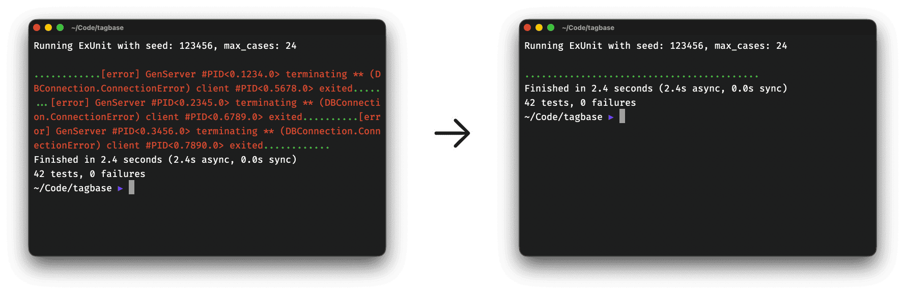

# wait_for_async_assigns

Prevents "DBConnection.ConnectionError: client exited" errors in Phoenix LiveView tests

<p align="center">
  
</p>

## Installation

Add to your `mix.exs`:

```elixir
def deps do
  [
    {:wait_for_async_assigns, "~> 0.1.0", only: :test}
  ]
end
```

Import in your test case module (e.g., `test/support/conn_case.ex`):

```elixir
defmodule MyAppWeb.ConnCase do
  use ExUnit.CaseTemplate

  using do
    quote do
      import Phoenix.ConnTest
      import Phoenix.LiveViewTest
      import WaitForAsyncAssigns

      @endpoint MyAppWeb.Endpoint
    end
  end
end
```

Import the formatter config in `.formatter.exs`:

```elixir
[
  import_deps: [:phoenix, :wait_for_async_assigns],
  # ...
]
```

## Usage

Call `wait_for_async_assigns/1` at the end of LiveView tests that use async operations:

```elixir
test "loads data asynchronously", %{conn: conn} do
  {:ok, view, _html} = live(conn, ~p"/products")
  html = render_async(view)
  assert html =~ "Products"

  wait_for_async_assigns(view)
end
```

The function waits for all async tasks to complete before the test exits, preventing connection errors.

**Custom timeout:**

```elixir
wait_for_async_assigns(view, 10_000)  # Wait up to 10 seconds
```

Default timeout is 100ms (configurable via `config :ex_unit, assert_receive_timeout: 1000`).

## Optional Credo Check

This package includes a Credo check that warns when LiveView tests are missing `wait_for_async_assigns/1`.

Add to `.credo.exs`:

```elixir
%{
  configs: [
    %{
      name: "default",
      requires: ["deps/wait_for_async_assigns/lib/credo/check/wait_for_async_assigns.ex"],
      checks: %{
        enabled: [
          {Credo.Check.WaitForAsyncAssigns, []}
        ]
      }
    }
  ]
}
```

## Resources

- [Phoenix LiveView Issue #3545](https://github.com/phoenixframework/phoenix_live_view/issues/3545)

## License

MIT License - see [LICENSE](LICENSE) for details.

## Contributing

Contributions are welcome! Please open an issue or pull request on [GitHub](https://github.com/tagbase-io/wait_for_async_assigns).

## Credits

Created by [Mario Uher](https://github.com/ream88).
